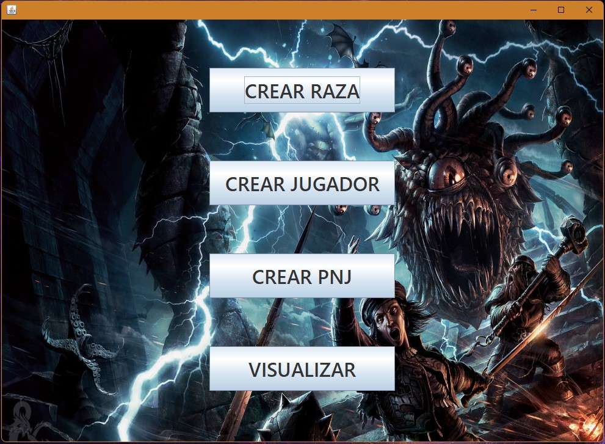
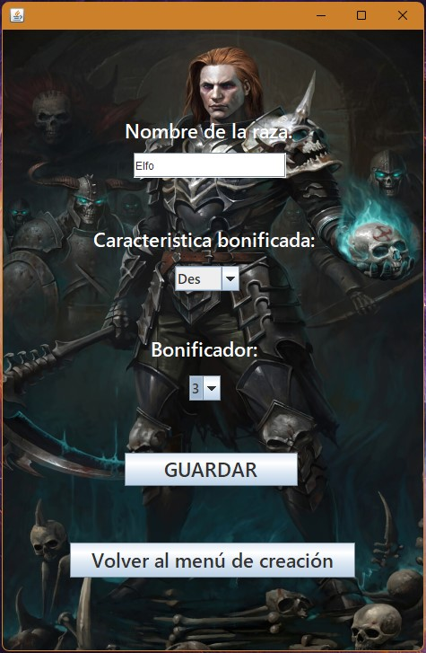
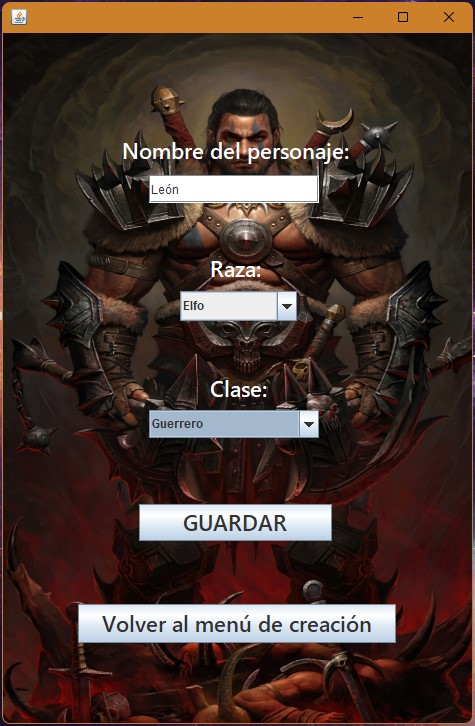
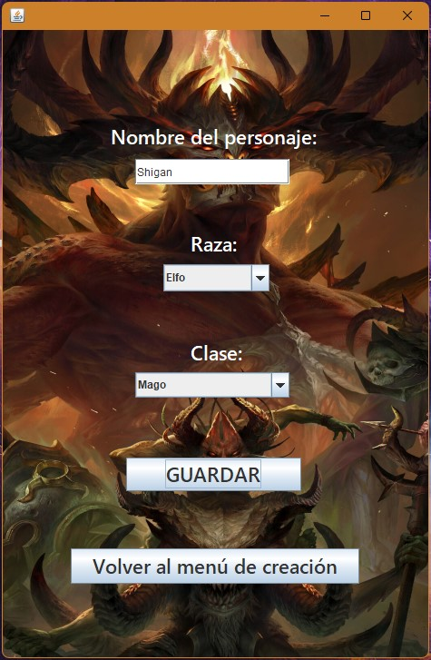

# Demo-Rol-Interface
Una pequeña demo de una Interfaz de usuario de un app (GUI) desarrollada con Java (Buena lógica de programación y POO) y Swing (GUI)

## Tecnologías utilizadas
- **JAVA**: Lógica de programación y POO
- **Swing**: Estructura y diseño de la interfaz de usuario

## Capturas de Pantalla

.
