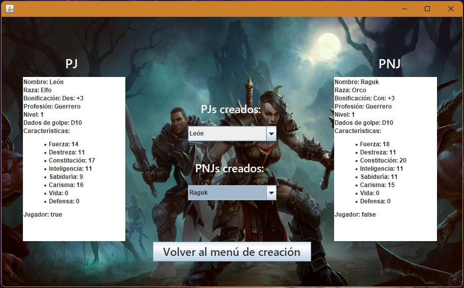

# Demo-Rol-Interface
A small demo of an application GUI developed with Java (Good programming logic and OOP) and Swing (GUI)

## Tecnologías utilizadas
- **JAVA**: Lógica de programación y POO
- **Swing**: Estructura y diseño de la interfaz de usuario

## Capturas de Pantalla

.
